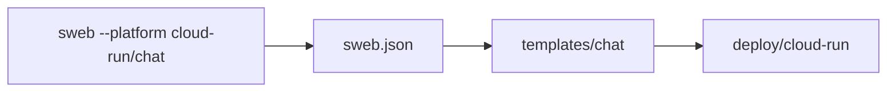

# SwiftWeb Cloud Run

Cloud Run platform templates for SwiftWeb.

This repository is referenced by `sweb --platform cloud-run` and explicit GitHub
references such as `sweb --platform 1amageek/swift-web-cloud-run/chat`.

| Path | Purpose |
|---|---|
| `sweb.json` | Adapter template manifest consumed by `sweb`. |
| `templates/new` | Default Cloud Run scaffold. |
| `templates/chat` | Cloud Run scaffold for chat-oriented apps. |

Each template entry in `sweb.json` carries `https://github.com/1amageek/swift-web`
as its SwiftWeb reference URL. The template directories are copied relative to the
SwiftWeb app package root.
